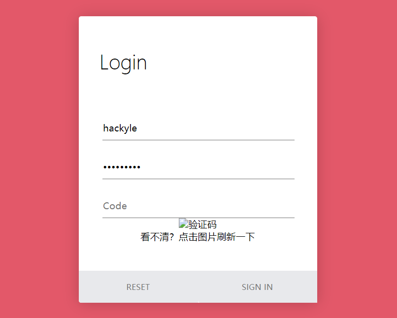

**收录登录Login页面**

**参考：**

- 65+ Login Page in HTML with CSS Code https://www.codehim.com/collections/login-page-in-html-with-css-code/

---

# PureLoginPageWithVerificationCode

**源代码：** [PureLoginPageWithVerificationCode](./PureLoginPageWithVerificationCode.html)

**依赖：** jQuery，主要用于发起Ajax请求

**验证码，** 相关示例：https://github.com/HackyleShawe/JavaDemos/tree/master/Examples/kaptcha-demo

**暂不适配移动端，** 无法处理不同终端上表单的宽度问题

